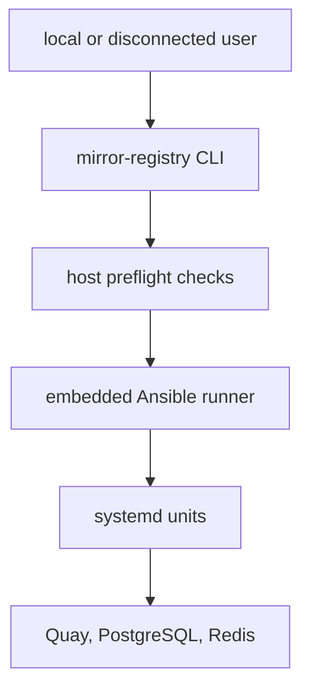

# mirror-registry Architecture

## Purpose

CLI for installing Quay on RHEL/Fedora for air-gapped OpenShift environments.



## High-Level Design

```
mirror-registry CLI
    ↓ Ansible playbooks
Podman + systemd services
    ↓ Container runtime
[Postgres, Redis, Quay]
```

## Components

### `/cmd/mirror-registry`
CLI entrypoint:
- `install`: Initial deployment
- `upgrade`: Version upgrade
- `uninstall`: Full removal
- `pause`/`unpause`: Service control

### `/ansible-runner`
Embedded Ansible playbooks:
- `install.yml`: Fresh install
- `upgrade.yml`: Version migration
- `uninstall.yml`: Cleanup
- Roles: postgres, redis, quay, certificates

### `/pkg/installer`
Install orchestration:
- Preflight checks (ports, disk, selinux)
- Ansible execution
- Systemd service creation

## Install Flow

```
1. CLI: mirror-registry install --quayHostname quay.example.com
2. Preflight checks:
   - RHEL/Fedora version
   - Podman installed
   - Ports 80/443/5432/6379 available
   - Disk space (>50GB)
   - SELinux mode
3. Generate certificates (self-signed or provided)
4. Run Ansible:
   a. Install Postgres container (systemd unit)
   b. Initialize Quay database
   c. Install Redis container (systemd unit)
   d. Generate Quay config.yaml
   e. Install Quay container (systemd unit)
5. Start services via systemd
6. Print login credentials
```

## Ansible Roles

### `postgres` role
```yaml
- Pull postgres:13 image
- Create /var/lib/pgsql-mirror-registry volume
- Generate systemd unit (postgresql-mirror-registry.service)
- Enable + start service
- Create quay database
```

### `redis` role
```yaml
- Pull redis:6 image
- Generate systemd unit (redis-mirror-registry.service)
- Enable + start service
```

### `quay` role
```yaml
- Pull quay:<version> image
- Generate config.yaml (postgres + redis endpoints)
- Create /var/lib/quay-mirror-registry volume
- Generate systemd unit (quay-mirror-registry.service)
- Enable + start service
```

## Configuration

Generated in `/etc/quay-mirror-registry/config.yaml`:

```yaml
DB_URI: postgresql://postgres@localhost/quay
BUILDLOGS_REDIS:
  host: localhost
  port: 6379
USER_EVENTS_REDIS:
  host: localhost
  port: 6379
FEATURE_MAILING: false
PREFERRED_URL_SCHEME: https
SERVER_HOSTNAME: quay.example.com
```

## Systemd Services

```
postgresql-mirror-registry.service
redis-mirror-registry.service
quay-mirror-registry.service
```

All use:
- Restart=always
- Podman container backend
- Host network mode

## Upgrade Flow

```
1. CLI: mirror-registry upgrade --targetVersion 3.11.0
2. Pull new Quay image
3. Stop quay-mirror-registry.service
4. Run database migrations (if needed)
5. Update systemd unit with new image
6. Start quay-mirror-registry.service
7. Verify health
```

## Uninstall Flow

```
1. CLI: mirror-registry uninstall
2. Stop all services
3. Remove containers
4. Remove systemd units
5. Optionally remove data directories
```

## Offline/Air-Gapped Support

```
1. Download bundle on connected host:
   mirror-registry package --targetVersion 3.11.0

2. Transfer bundle to air-gapped host

3. Install from bundle:
   mirror-registry install --from-bundle mirror-registry.tar.gz
```

## File Locations

- Binaries: `/usr/local/bin/mirror-registry`
- Config: `/etc/quay-mirror-registry/`
- Data: `/var/lib/quay-mirror-registry/`, `/var/lib/pgsql-mirror-registry/`
- Systemd: `/etc/systemd/system/*-mirror-registry.service`
- Certificates: `/etc/quay-mirror-registry/ssl/`
